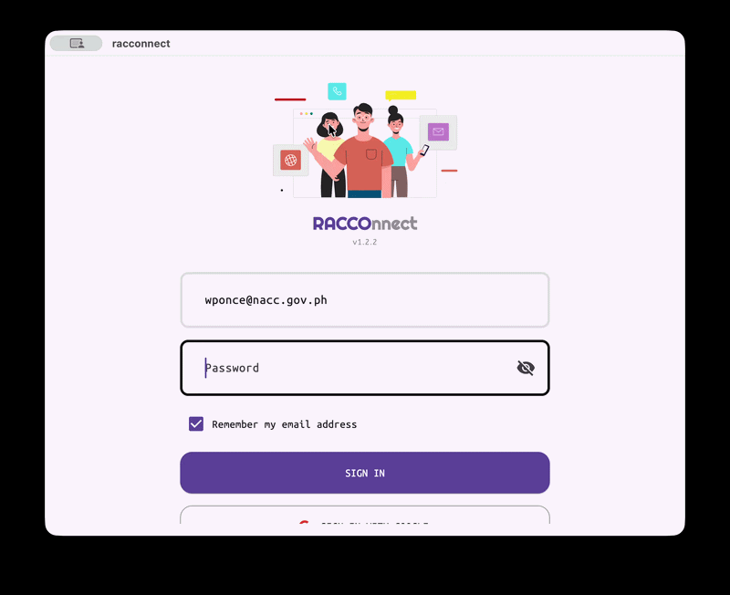

# RACCOnnect

**Regional Alternative Child Care Office IV-A Calabarzon Companion App**

## Overview

RACConnect is a comprehensive employee management system developed for the **National Authority for Child Care - Regional Alternative Child Care Office IV-A Calabarzon**. The application streamlines attendance tracking, DTR and accomplishment reporting, through a modern, cross-platform interface. 

### Key Features
- **Work From Home (WFH) Attendance** - Secure attendance tracking for remote work.
- **Daily Accomplishment Logging** - Easy tracking of daily tasks and deliverables.
- **Personnel Directory** - Centralized directory for certain user roles.
- **Automated Report Export** - High-quality PDF generation for Annex A (WFH) and Accomplishment Reports with multi-page support and robust text handling.
- **Forum Certificate Generation** - Automated generation of high-quality attendance certificates from customizable SVG templates.
- **Bulk Email Delivery** - Integrated SMTP system for sending certificates to forum attendees with support for HTML templates and multiple recipients.
- **Signatory Management** - Flexible signatory selection for report approvals.

## Platform Availability

| Platform | Status | Requirements |
|----------|--------|--------------|
| **Windows** | ✅ Available | Windows 11 or higher |
| **macOS** | ✅ Available | macOS Sonoma or higher |
| **Android** | ✅ [Get it on Google Play](https://play.google.com/store/apps/details?id=com.codecarpentry.racconnect) | Android 11 or higher |
| **iOS** | 🔜 Planned | (waiting for apple developer subscription) |
## Security Features

- **Time Tampering Detection** - Prevents manipulation of system time
- **Role-Based Access Control** - Granular permissions per user role
- **Encrypted Communications** - SSL/TLS enforced

## Server (Minimal Requirements)

### 
- **CPU**: 1 CPU minimum
- **RAM**: 1 GiB minimum
- **Storage**: 20 GiB (More if you will incorporate more file handling)
- **Bandwidth**: at least 200 Mbps
- **OS**: Any LTS debian distro, however it was only test on Ubuntu 24 LTS

## 📞 Support

For technical support and inquiries:
- 📧 **Development Support**: [owen@codecarpentry.com](mailto:owen@codecarpentry.com)
- 📧 **Official Inquiries**: [wponce@nacc.gov.ph](mailto:wponce@nacc.gov.ph)

## ⚠️ Important Disclaimer

> **Ownership Notice**: This codebase is the property of the **National Authority for Child Care - Regional Alternative Child Care Office IV-A Calabarzon**. The repository serves as a temporary safekeeping solution until an official centralized git server becomes available.

> **License Notice**: While this project is currently under the MIT License - see the [LICENSE](LICENSE) file for details. The **National Authority for Child Care - Regional Alternative Child Care Office IV-A Calabarzon** retains all rights to the codebase and its intellectual property.

## 🙏 Acknowledgments

- **Regional Alternative Child Care Office IV-A Calabarzon** - For the opportunity to develop this system
- **Open Source Community** - For the amazing tools and libraries

---

*Made with ❤️ for the dedicated staff of RACCO IV-A Calabarzon* 🇵🇭
